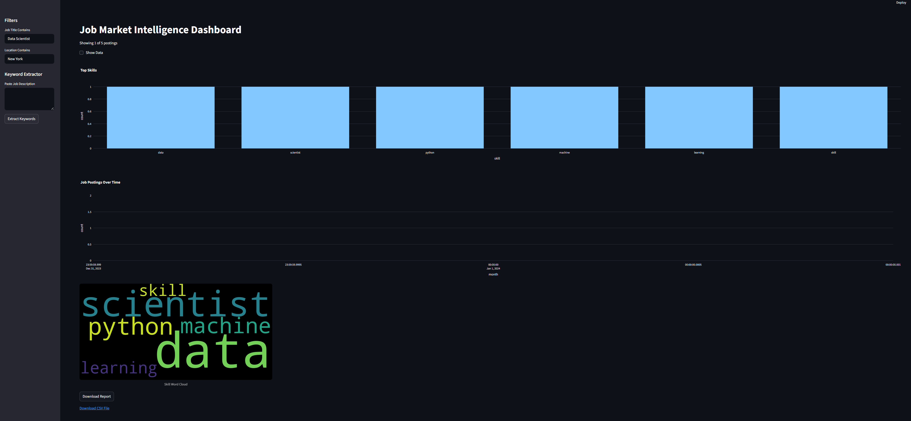

# Job Market Dashboard

This Streamlit app analyzes job postings to showcase current market trends.



## Features
- Skill demand bar chart
- Keyword extraction from descriptions
- Timeline of job posting activity
- Search and filter interface
- CSV export of filtered results

## Running the App

1. Install dependencies
   ```bash
   pip install -r requirements.txt
   ```
2. Launch Streamlit
   ```bash
   streamlit run app.py
   ```

Sample data is included in `data/jobs.csv`.